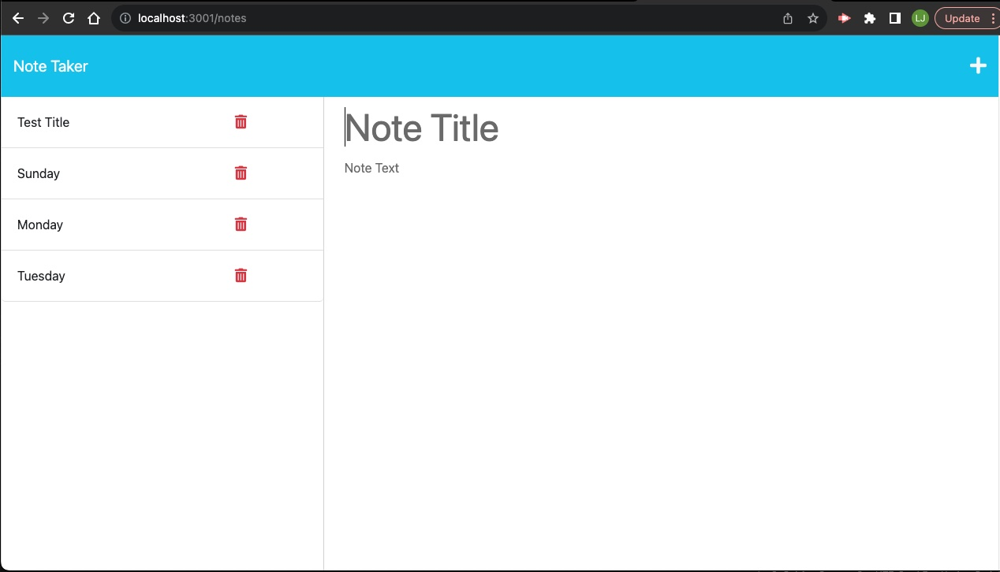
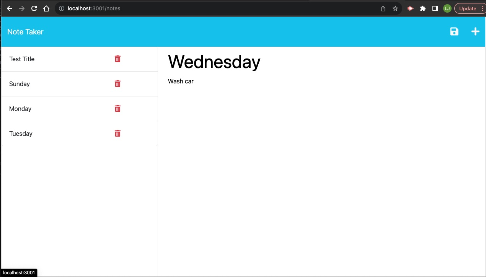
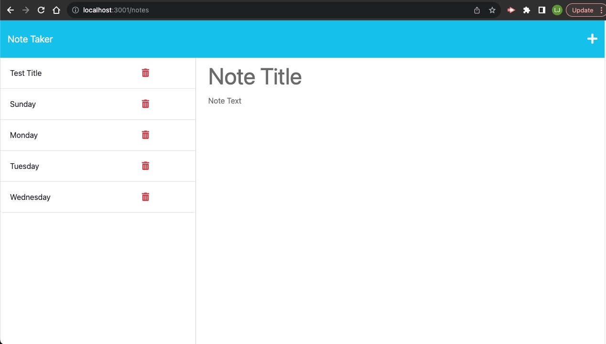

# Who-Still-Takes-Notes

## Description

The following challenge wants to enable users to write and save notes so that the user is able to stay organized. The assignment would be complete when the the front end is connected to an Express.js back end. The developer will being using GET and POST methods. The GET method will retrieve a notes.html and index.html file. The POST method will allow the user when interacting with the website to be able to save a new note on the request body and have it added to the db.json file and then return the new note to the client giving each note a unique ID. The assignment is to be uploaded to Heroku.

## Website Link

[Note Taker](https://who-still-takes-notes-fe3866ef6510.herokuapp.com/)

## Screenshot

## Credits

My tutor Andrew Jimenez looked over my code and helped me remove what was unnecessary. He also helped me in fixing my links so everything could respond properly.